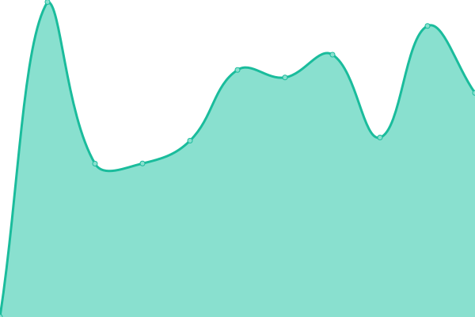
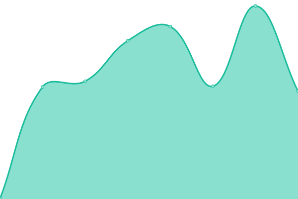

# [📈 Live Status](https://status.sanuja.biz): <!--live status--> **🟩 All systems operational**

This repository contains the open-source uptime monitor and status page for [Sanuja Seneviratne](https://sanuja.biz/), powered by [Upptime](https://github.com/upptime/upptime).

With [Upptime](https://upptime.js.org), you can get your own unlimited and free uptime monitor and status page, powered entirely by a GitHub repository. We use [Issues](https://github.com/SanujaNS/SanujaPut-Status/issues) as incident reports, [Actions](https://github.com/SanujaNS/SanujaPut-Status/actions) as uptime monitors, and [Pages](https://status.sanuja.biz) for the status page.

<!--start: status pages-->
<!-- This summary is generated by Upptime (https://github.com/upptime/upptime) -->
<!-- Do not edit this manually, your changes will be overwritten -->
<!-- prettier-ignore -->
| URL | Status | History | Response Time | Uptime |
| --- | ------ | ------- | ------------- | ------ |
|  [My Gateway Website](https://sanuja.biz/) | 🟩 Up | [my-gateway-website.yml](https://github.com/SanujaNS/SanujaPut-Status/commits/HEAD/history/my-gateway-website.yml) | 

 77ms
     
 | 

<a href="https://status.sanuja.biz/history/my-gateway-website">99.90%</a>
    

|  [My Blog](https://sanujas.com/) | 🟩 Up | [my-blog.yml](https://github.com/SanujaNS/SanujaPut-Status/commits/HEAD/history/my-blog.yml) | 

 97ms
     
 | 

<a href="https://status.sanuja.biz/history/my-blog">100.00%</a>
    

|  [SanujaPut-Music-1](https://smusic.sanujas.eu.org/) | 🟩 Up | [sanuja-put-music-1.yml](https://github.com/SanujaNS/SanujaPut-Status/commits/HEAD/history/sanuja-put-music-1.yml) | 

 1553ms
     
 | 

<a href="https://status.sanuja.biz/history/sanuja-put-music-1">99.66%</a>
    

|  [SanujaPut-Music-2](https://sanujas.serv00.net/) | 🟩 Up | [sanuja-put-music-2.yml](https://github.com/SanujaNS/SanujaPut-Status/commits/HEAD/history/sanuja-put-music-2.yml) | 

 1341ms
     
 | 

<a href="https://status.sanuja.biz/history/sanuja-put-music-2">99.66%</a>
    

|  [Lofi Beats](https://sanuja.rf.gd/) | 🟩 Up | [lofi-beats.yml](https://github.com/SanujaNS/SanujaPut-Status/commits/HEAD/history/lofi-beats.yml) | 

 623ms
     
 | 

<a href="https://status.sanuja.biz/history/lofi-beats">100.00%</a>
    

|  [Nightcore Music](https://ncore.sanujas.eu.org/) | 🟩 Up | [nightcore-music.yml](https://github.com/SanujaNS/SanujaPut-Status/commits/HEAD/history/nightcore-music.yml) | 

 378ms
     
 | 

<a href="https://status.sanuja.biz/history/nightcore-music">98.44%</a>
    

|  [YourIP](https://sanuja.biz/projects/tools/yourip) | 🟩 Up | [your-ip.yml](https://github.com/SanujaNS/SanujaPut-Status/commits/HEAD/history/your-ip.yml) | 

 53ms
     
 | 

<a href="https://status.sanuja.biz/history/your-ip">99.90%</a>
    

|  [IPLookup](https://sanuja.biz/projects/tools/iplookup) | 🟩 Up | [ip-lookup.yml](https://github.com/SanujaNS/SanujaPut-Status/commits/HEAD/history/ip-lookup.yml) | 

 15ms
     
 | 

<a href="https://status.sanuja.biz/history/ip-lookup">100.00%</a>
    

|  [YT Data Extractor](https://yt.sanuja.eu.org/) | 🟩 Up | [yt-data-extractor.yml](https://github.com/SanujaNS/SanujaPut-Status/commits/HEAD/history/yt-data-extractor.yml) | 

 5430ms
     
 | 

<a href="https://status.sanuja.biz/history/yt-data-extractor">98.77%</a>
    

|  [Golden Maple Web Radio Player](https://gm.sanuja.eu.org/) | 🟩 Up | [golden-maple-web-radio-player.yml](https://github.com/SanujaNS/SanujaPut-Status/commits/HEAD/history/golden-maple-web-radio-player.yml) | 

 2528ms
     
 | 

<a href="https://status.sanuja.biz/history/golden-maple-web-radio-player">98.81%</a>
    

|  [Sound Scenes](https://ss.sanuja.eu.org/) | 🟩 Up | [sound-scenes.yml](https://github.com/SanujaNS/SanujaPut-Status/commits/HEAD/history/sound-scenes.yml) | 

 886ms
     
 | 

<a href="https://status.sanuja.biz/history/sound-scenes">98.85%</a>
    

|  [SanujaPut_Bin (Pastebin Alternative)](https://bin.sanuja.eu.org/) | 🟩 Up | [sanuja-put-bin-pastebin-alternative.yml](https://github.com/SanujaNS/SanujaPut-Status/commits/HEAD/history/sanuja-put-bin-pastebin-alternative.yml) | 

 1275ms
     
 | 

<a href="https://status.sanuja.biz/history/sanuja-put-bin-pastebin-alternative">98.90%</a>
    

|  [Social Media Downloader](https://dl.sanuja.eu.org/) | 🟩 Up | [social-media-downloader.yml](https://github.com/SanujaNS/SanujaPut-Status/commits/HEAD/history/social-media-downloader.yml) | 

 808ms
     
 | 

<a href="https://status.sanuja.biz/history/social-media-downloader">98.94%</a>
    

|  Oracle File Index | 🟩 Up | [oracle-file-index.yml](https://github.com/SanujaNS/SanujaPut-Status/commits/HEAD/history/oracle-file-index.yml) | 

 391ms
     
 | 

<a href="https://status.sanuja.biz/history/oracle-file-index">100.00%</a>
    

|  Private-DNS (ADGuard) | 🟩 Up | [private-dns-ad-guard.yml](https://github.com/SanujaNS/SanujaPut-Status/commits/HEAD/history/private-dns-ad-guard.yml) | 

 693ms
     
 | 

<a href="https://status.sanuja.biz/history/private-dns-ad-guard">100.00%</a>
    

<!--end: status pages-->

[**Visit our status website →**](https://status.sanuja.biz)

## 📄 License

- Powered by: [Upptime](https://github.com/upptime/upptime)
- Code: [MIT](./LICENSE) © [Sanuja Seneviratne](https://sanuja.biz/)
- Data in the `./history` directory: [Open Database License](https://opendatacommons.org/licenses/odbl/1-0/)
